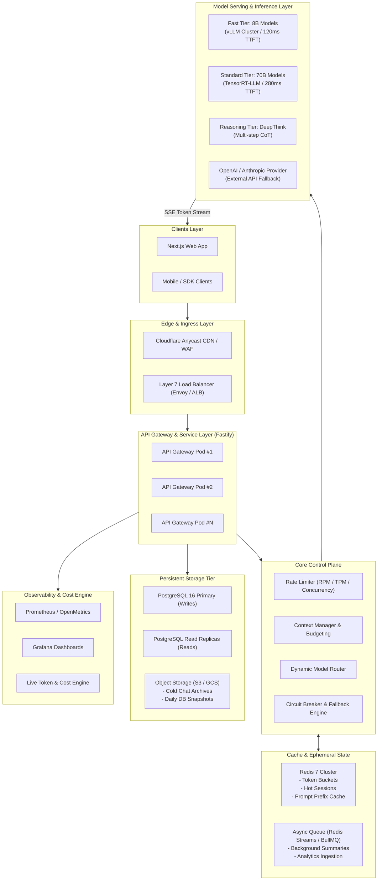
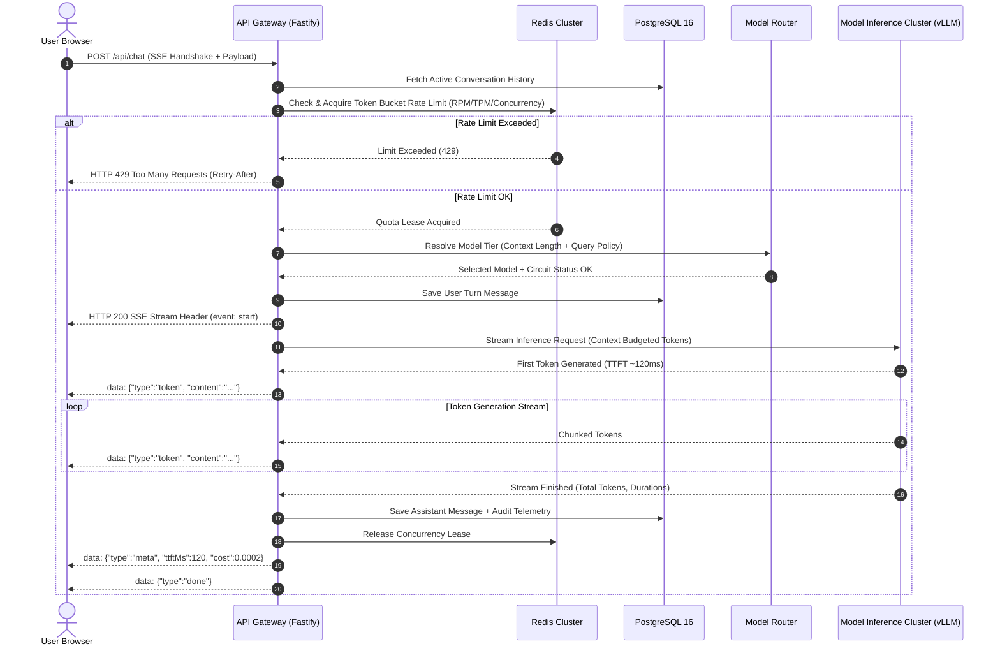
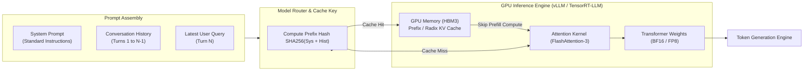
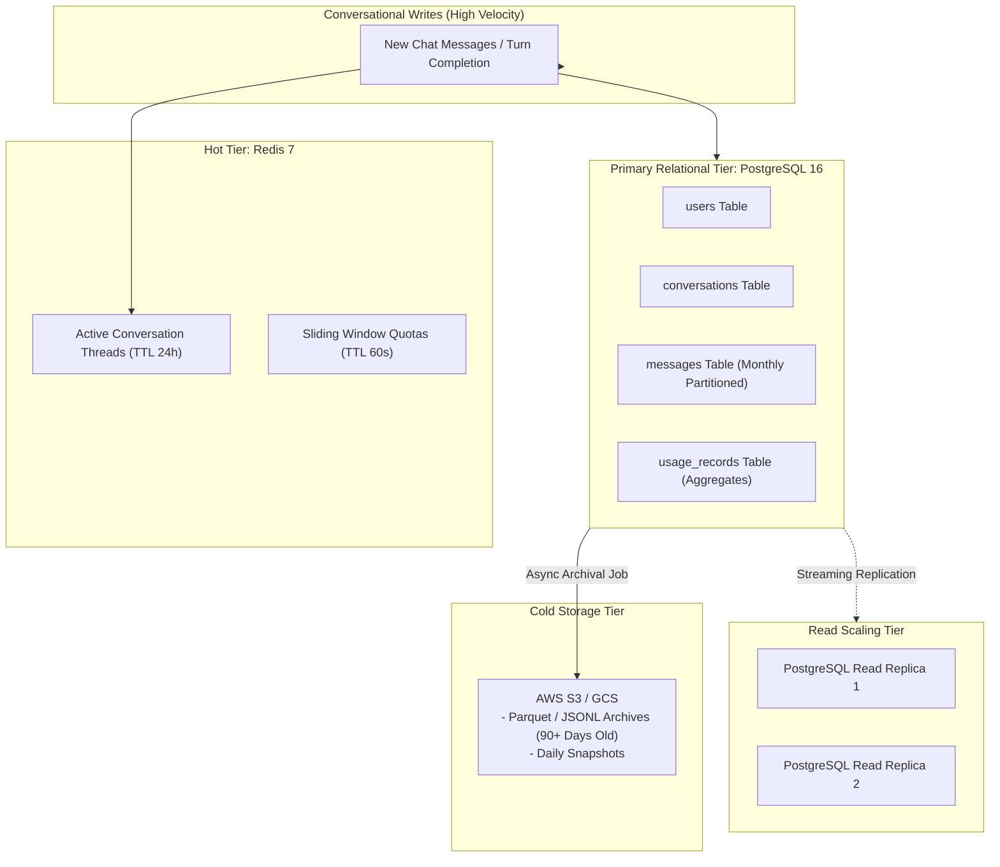
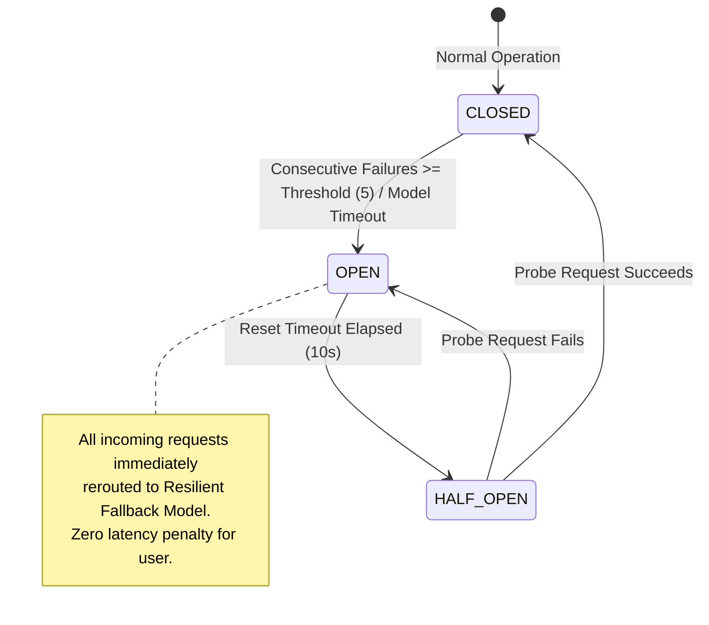
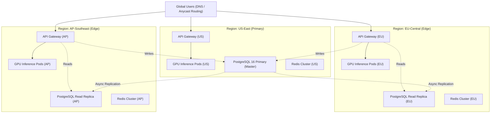

# Architecture Diagrams: ChatGPT-like AI System for 1M Users

This document outlines the end-to-end architectural topologies, request flows, data tiering, and resilience state machines for the 1M-user platform.

---

## Diagram 1: High-Level End-to-End System Architecture

---

## Diagram 2: Chat Request Streaming Lifecycle

---

## Diagram 3: LLM Inference & Prefix/KV Caching Topology

---

## Diagram 4: Data Architecture & Persistence Strategy

---

## Diagram 5: Resilience & Circuit Breaker State Machine

---

## Diagram 6: Multi-Region Global Topology

